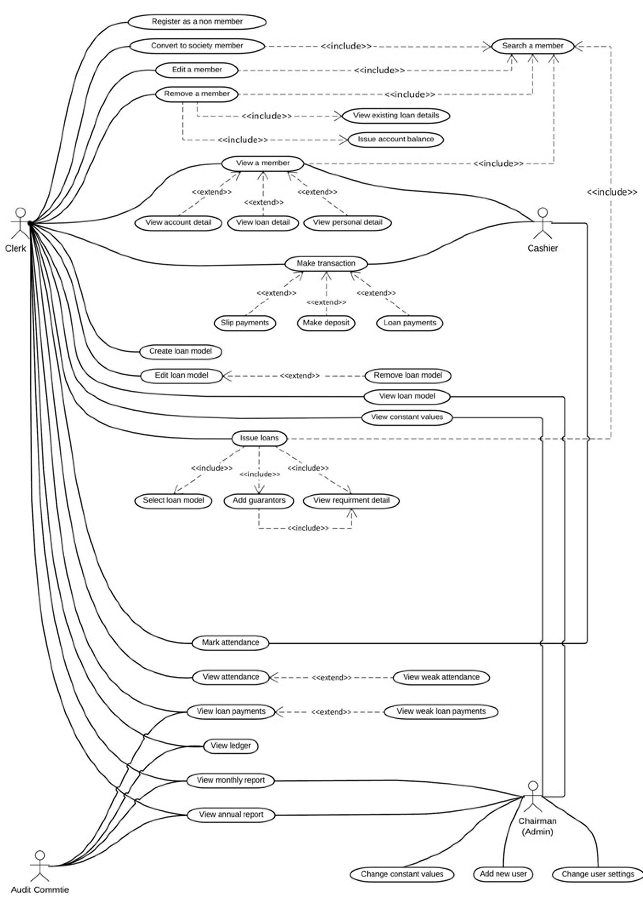
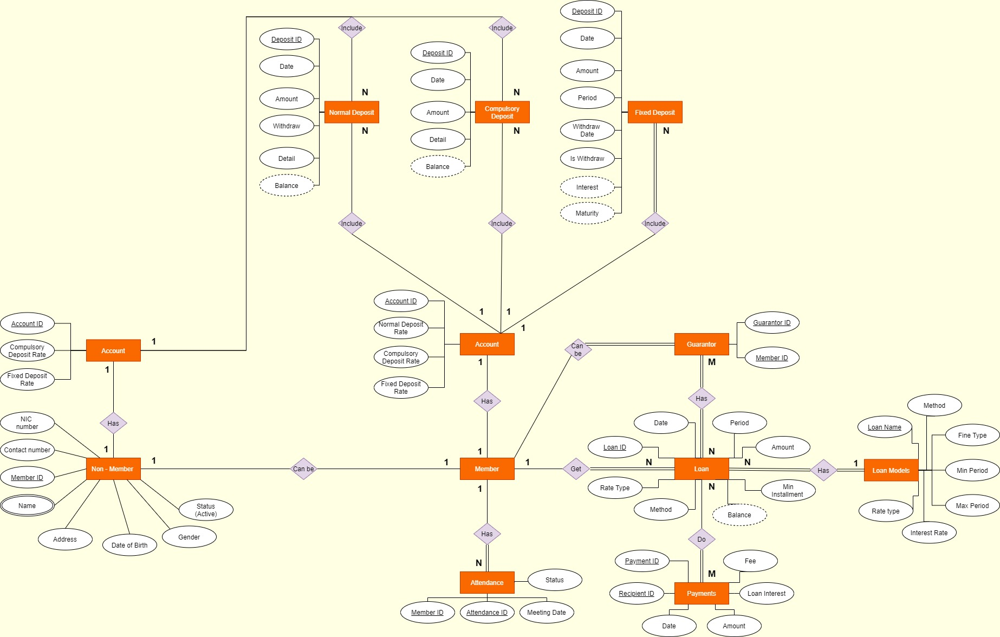
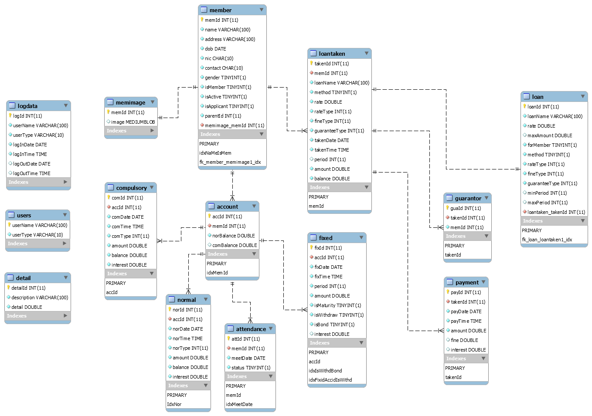
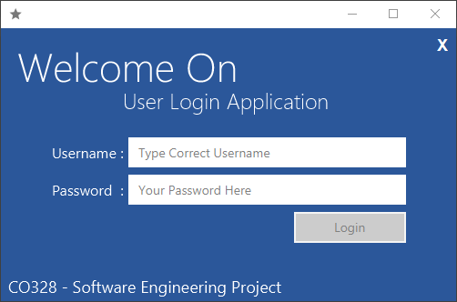
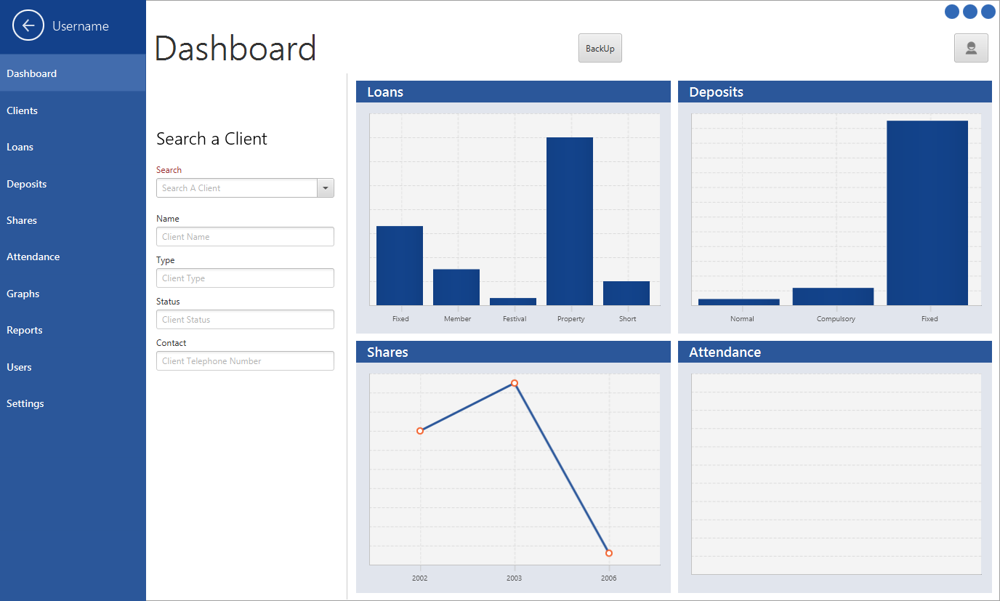
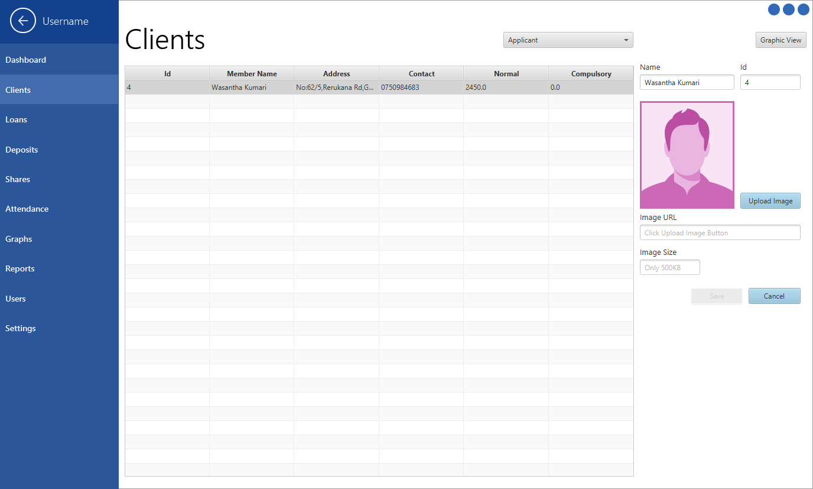
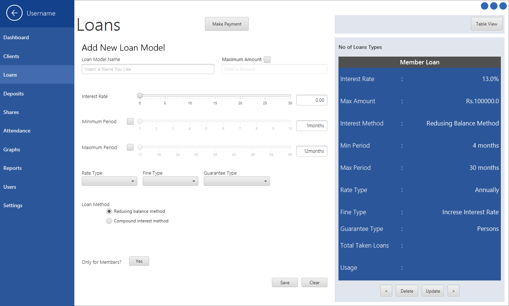
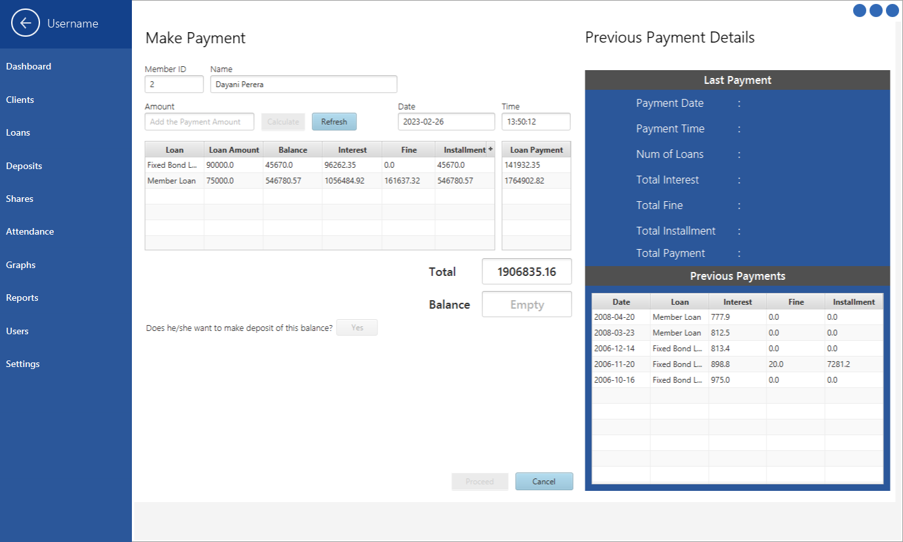
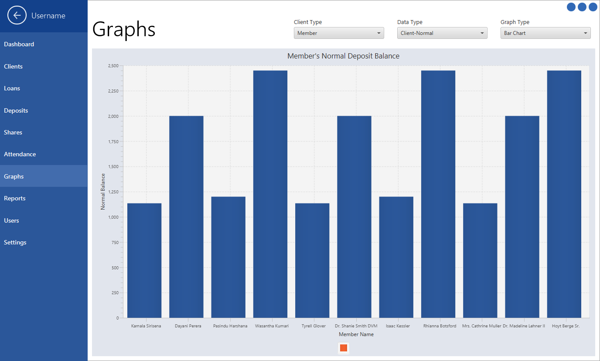
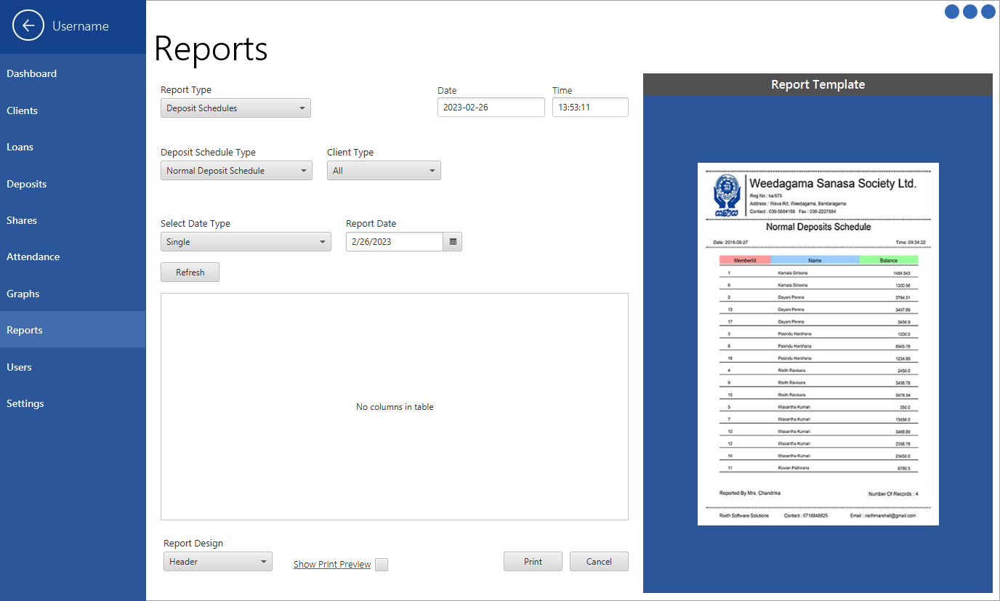

<a name="readme-top"></a>

<!-- PROJECT LOGO -->
<br />
<div align="center">
  <a href="https://github.com/othneildrew/Best-README-Template">
    
  </a>

<h3 align="center">Sanasa Bank System Project</h3>

  <p align="center">
    An awesome monolithic system to manage bank deposits and loans
    <br />
    <a href="https://github.com/RisithPerera/sanasaBankSystem/issues">Report Bug</a>
    ·
    <a href="https://github.com/RisithPerera/sanasaBankSystem/issues">Request Feature</a>
  </p>
</div>

<!-- TABLE OF CONTENTS -->
<details>
  <summary>Table of Contents</summary>
  <ol>
    <li><a href="#introduction">Introduction</a></li>
    <li><a href="#implementation">Implementation</a></li>
    <li><a href="#system-overview">System Overview</a></li>
    <li><a href="#how-to-run">How to Run</a></li>
    <li><a href="#review">Review</a></li>
    <li><a href="#contact">Contact</a></li>
  </ol>
</details>

## Introduction
The Bank System project is a monolithic architecture designed for Sanasa Bank, a local bank in Sri Lanka. The system is built to manage members' accounts and transactions, including deposits and loans. The project was built using JavaFx for the front end and MySQL for the backend database.

- ### Functionality
    The Bank System project allows users to perform the following operations:

   1. [x] Create and manage member accounts
   2. [x] Create and manage deposits and withdrawals
   3. [x] Apply for and manage loans
   4. [x] Generate reports on member accounts, transactions, and loans

<p align="right">(<a href="#readme-top">back to top</a>)</p>

## Implementation

- ### Programming Languages and techniques Used
  * Java
  * MySQL
  * JavaFx
  * FXML
  * CSS

- ### Development Tools Used
  * Net Beans (Early Stage in the project)
  * IntelliJ IDEA
  * Data Grip
  * JavaFX SceneBuilder

- ### Design Patterns
  - #### Singleton Design Pattern
    In our project, the back end that makes connections to MySQL database. To Avoid Dirty connections across the database and java program we have used singleton pattern to ensure we have only one database connection available at any point of time. We did it because, database connections are a limited resource. Some DBs have a very low connection limit, and wasting connections is a major problem. By consuming many connections, you may be blocking others for using the database.

  - #### Factory Design Pattern
    Our Project has around 17 Model classes and 14 database controller classes. Creating objects from this classes all over the places in GUI controllers, the overall project code will become messy. That’s why we implemented Factories called “ModelFactory” and “ControllerFactory” for both Model classes and database controller classes.

- ### Design Diagrams
1. Use Case Diagram\
   


2. Conceptual Design\
   


3. Physical Model\
   

<p align="right">(<a href="#readme-top">back to top</a>)</p>

## System Overview

<p float="left">
    
    
    
    
    
    
    
</p>
<p align="right">(<a href="#readme-top">back to top</a>)</p>

## How to Run
This is an example of how you may give instructions on setting up this project locally. To get a local copy up and running follow these simple steps.

### Prerequisites
First you need to install Java, MySQL Server and IntelliJ IDEA in your computer.
  * Java - https://www.oracle.com/java/technologies/downloads/
  * MySQL - https://www.mysql.com/downloads/
  * IntelliJ - https://www.jetbrains.com/idea/

### Installation
1. Install Java and MySQL Server
2. Clone the repository
    ```bash
    git clone https://github.com/cepdnaclk/e15-co328-Banking-Management-System.git
    ```
3. Open the project from IntelliJ IDEA
4. Apply the database script from this location into the MySQL Server
    ```bash
    e15-co328-Banking-Management-System/src/main/resources/dbScript/
    ```
5. Build the project using Maven
    ```bash
    mvn clean install
    ```
6. Run the application from the target folder using console
    ```bash
    start javaw -jar SANASA-1.0.0-SNAPSHOT.jar
    ```

<p align="right">(<a href="#readme-top">back to top</a>)</p>

## Review
- ### Architecture
    The Bank System project is built using a monolithic architecture, which means that both the front end and back end are combined into a single application. The user interface is developed using JavaFx, which is a Java-based GUI framework that allows developers to create rich client applications. The backend database is implemented using MySQL, a popular open-source relational database management system.

- ### Development
    The Bank System project was developed at an early stage in the programmer's career. Despite this, the project demonstrates the ability to create a functional application that addresses real-world business needs. The monolithic architecture used in the project is a simple yet effective approach for building applications that do not require complex scalability or distributed architectures.

- ### Conclusion
    Overall, the Bank System project is a useful tool for managing member accounts and transactions for Sanasa Bank. The project demonstrates the use of JavaFx for the front end and MySQL for the backend database, as well as the use of a monolithic architecture for building simple yet effective applications.

<p align="right">(<a href="#readme-top">back to top</a>)</p>

## Contact
 Name: Risith Perera</br>
 LinkedIn: [Profile](https://linkedin.com/in/risith)</br>
 Email: risithperera@eng.pdn.ac.lk </br>
 Project Link: [https://github.com/RisithPerera/sanasaBankSystem]

<p align="right">(<a href="#readme-top">back to top</a>)</p>