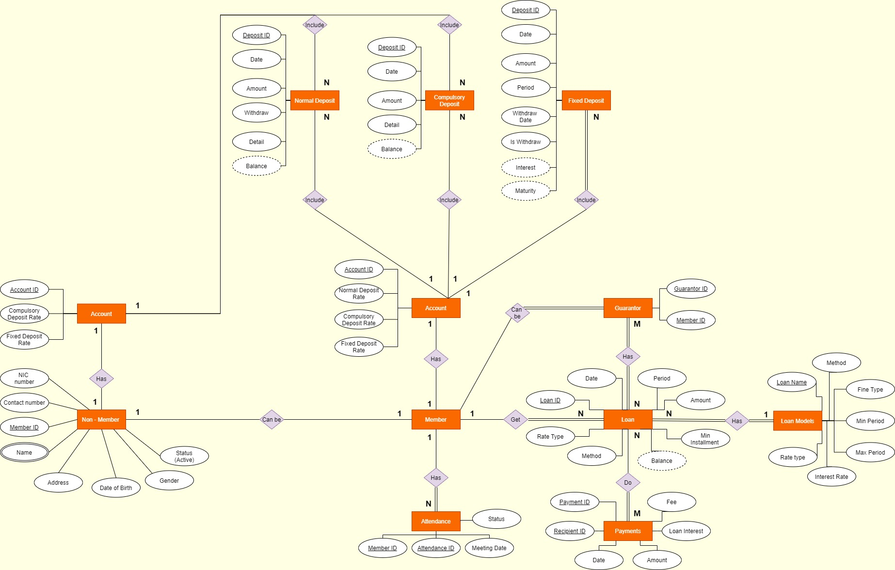
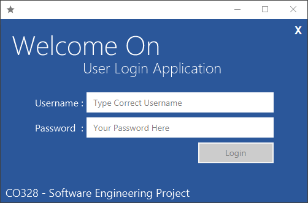
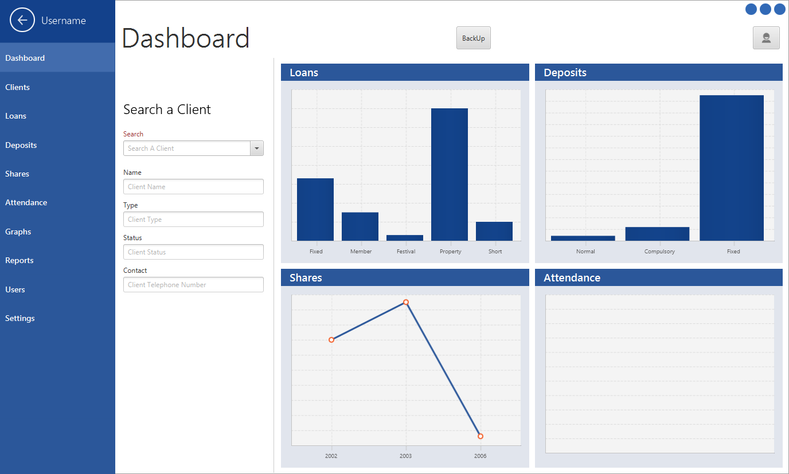
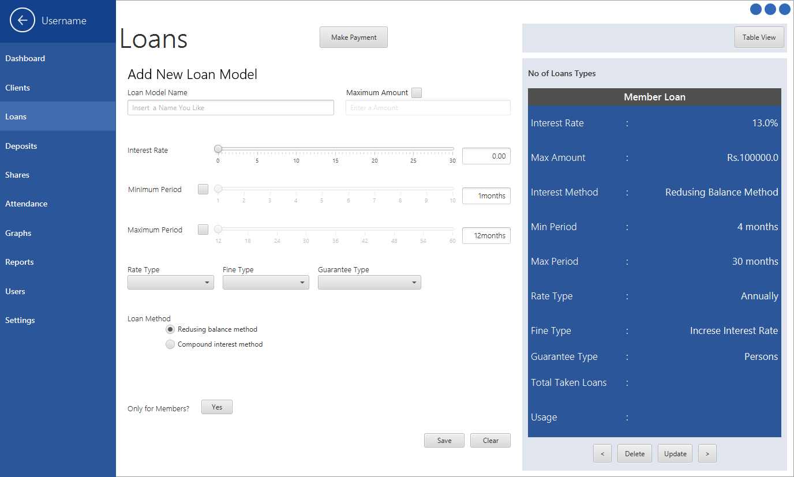
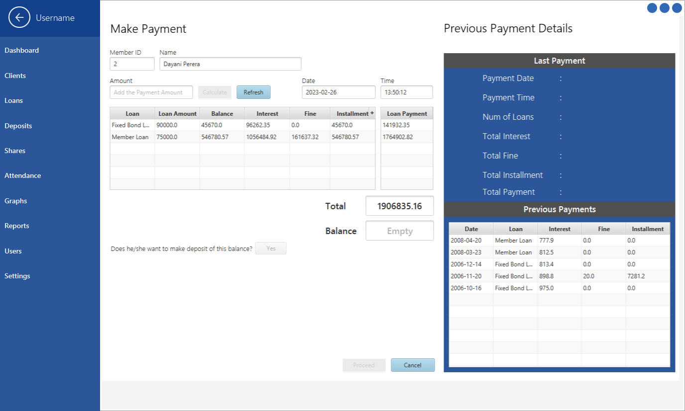
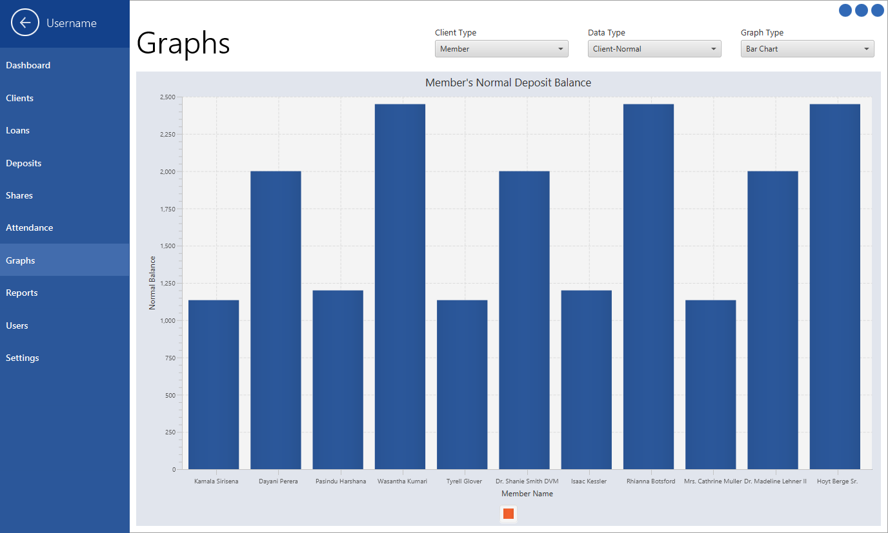

[comment]: # "This is the standard layout for the project, but you can clean this and use your own template"

# Banking Management System for "SANASA Society"

#### Team

- E/15/265, Risith Perera, [email](mailto:risithperera@eng.pdn.ac.lk)
- E/15/010, Ruchika Alwis, [email](mailto:e15010@eng.pdn.ac.lk)
- E/15/347, Isuru Sudasinghe, [email](mailto:isuru.sudasinghe@eng.pdn.ac.lk)

#### Supervisors

- Dr. Janaka Alawatugoda, [email](mailto:alawatugoda@eng.pdn.ac.lk)

#### Table of content

1. [Abstract](#abstract)
2. [Related works](#related-works)
3. [Methodology](#methodology)
4. [Experiment Setup and Implementation](#experiment-setup-and-implementation)
5. [System Overview](#system-overview)
6. [Conclusion](#conclusion)
7. [Links](#links)

---

## Abstract
<b>Sanasa Society Bank System</b> is a software solution for managing members and money transactions of sanasa society. Banking system of Sanasa society is a little bit different from other banks.
There are 2 main reasons for that.

- SANASA branches operate as independent entities without many interactions with other SANASA branches of the country. 
- Since its necessary to become a member to open a bank account, its mandatory to manage membership accounts along with the bank accounts in sanasa society.
      (In a normal bank, the user detail are directly included in his bank account. Here, a bank account is an extend feature of the member account)

The software system addresses 4 key components of the SANASA society.
- Manage Members
- Manage Deposits
- Manage Loans
- Manage Documentations (Audit reports, attendance reports, etc.)

There are 3 user types for the system
- Administrators : who can create and delete accounts records
- Accountants : who can manage transactions of the accounts
- Audits : who can check reports generated by the systems

The SSBS aims at simplifying the processes of the society that are carried out manually by implementing a digital structure.

## Related Works
In order to create an effective bank management system for <a href=https://sanasa.coop/>SANASA</a>, a thorough investigation 
of the current methods used by the bank was necessary. Visiting the village branch and gathering 
information about how they manage their member's deposits and loans was the first step in this process. 
The accounting tables were examined to gain insight into the manual methods used to keep track of 
financial transactions. By carefully analyzing this information, an entity relationship diagram was 
designed to accurately represent the structure and flow of data within the bank. 
This careful attention to detail and in-depth research laid the foundation for a successful implementation 
of the bank management system.

### Functional Requirements Analysis

#### Manage Members
1. System should create 3 types of user accounts upon request.
   - Member
   - Non-Member
   - Child Member

2. Child Member account can be opened by parents for their children. In addition, it has 2 types of following child accounts. The system should be able to create these two sub categorical accounts as well.
   - Guardian child deposit accounts
   - Self-child deposit accounts

3. A Nonmember account should be able to convert into a member account (This should be with the approval from a current valid member - under the 1.6 and 1.7 sub constitution).

4. In addition system should keep details about society member applicants and the Non-member applicants. Then the software should check the attendance of an adult member for monthly congress meeting for 3 months and depending on the result that member should be added to society member list.

5. These account should keep record of the membership fees (Initially 300/=) other payments regarding society activity

#### Manage Deposits
1. System should be able to create following types of deposits and manage their transactions
   - Member and Non-Member normal deposits
   - Member and Non-Member fixed deposits
   - Compulsory deposits
   - Children’s savings

2. Regarding Deposit Management
   - It should be able to make deposits and withdrawals.
   - The system should manage Normal/Fixed deposits of Members and Non-Members.
   - Separately handle compulsory deposits and notify delayed deposits.
   - All the interests should be calculated and added to the account.
   - Should allow one member to handle more fixed deposits for various periods of time.

3. Member and Non-Member Deposit Interest ratings are different for normal deposit and fixed deposit. (Generally, Member interest ratings are higher than Non-Member interest ratings.)

4. Compulsory deposits include only for Society Members. It is Compulsory for members to pay that deposits account monthly to protect their membership.

#### Manage Loans
1. There are some types of Loans defined by the society
   - Member Loans
   - Property Loans
   - Quick Loans
   - Fixed deposit basis Loans
   - Festival Loans
   - Short time loans

2. Regarding Loan Management
   - This should be able to 
     1.  Easily search loan history of the member
     2.	Search if the loan requirements are satisfied
     3.	Ability to fill out the loan application
     4.	Select relevant loan module
     5.	Issue approved loan
   - Should be able to create new loan types and edit existing loan modules according to the congress meeting decisions.
   - Notifications must be shown for the delayed installments of each month.

3. Most of these loan type interests are calculating under the reducing balance method.

4. The limit of maximum personal loan amount depends on behavior history of the member for any Loan types without fixed deposit basis loans.

#### Managing User Levels
1. There are 3 basic user levels to handle the system.
   - Admin	:	President, Vice President, Secretary, Treasurer.
   - Accountants	:	Accountants, Cashiers, Staff Members.
   - Audit	:	Audit from Same Branch, Audit from External Branch.

## Methodology
- ### Architecture
  The Bank System project is built using a monolithic architecture, which means that both the front end and back end are combined into a single application. The user interface is developed using JavaFx, which is a Java-based GUI framework that allows developers to create rich client applications. The backend database is implemented using MySQL, a popular open-source relational database management system.

- ### Development
  The Bank System project was developed at an early stage in the programmer's career. Despite this, the project demonstrates the ability to create a functional application that addresses real-world business needs. The monolithic architecture used in the project is a simple yet effective approach for building applications that do not require complex scalability or distributed architectures.

## Experiment Setup and Implementation

### Design Diagrams
1. Use Case Diagram

2. Conceptual Design

3. Physical Model

### Design Patterns
- #### Singleton Design Pattern
  In our project, the back end that makes connections to MySQL database. To Avoid Dirty connections across the database and java program we have used singleton pattern to ensure we have only one database connection available at any point of time. We did it because, database connections are a limited resource. Some DBs have a very low connection limit, and wasting connections is a major problem. By consuming many connections, you may be blocking others for using the database.

- #### Factory Design Pattern
   Our Project has around 17 Model classes and 14 database controller classes. Creating objects from this classes all over the places in GUI controllers, the overall project code will become messy. That’s why we implemented Factories called “ModelFactory” and “ControllerFactory” for both Model classes and database controller classes.

### Technology Stack
- #### Programming Languages and techniques Used
    * Java
    * MySQL
    * JavaFx
    * FXML
    * CSS

- #### Development Tools Used
    * Net Beans (Early Stage in the project)
    * IntelliJ IDEA
    * Data Grip
    * JavaFX SceneBuilder

## System Overview
Here are some screenshots of the user interfaces.

### Log In Window

### System Dashboard

### Loan Configuration Panel

### Installment Payment Form

### Analytical Section

## Conclusion
Overall, the Bank System project is a useful tool for managing member accounts and transactions for Sanasa Bank. The project demonstrates the use of JavaFx for the front end and MySQL for the backend database, as well as the use of a monolithic architecture for building simple yet effective applications.

## Links

[//]: # ( NOTE: EDIT THIS LINKS WITH YOUR REPO DETAILS )

- [Project Repository](https://github.com/cepdnaclk/e15-co328-Banking-Management-System)
- [Project Page](https://cepdnaclk.github.io/e15-co328-Banking-Management-System)
- [Department of Computer Engineering](http://www.ce.pdn.ac.lk/)
- [University of Peradeniya](https://eng.pdn.ac.lk/)

[//]: # "Please refer this to learn more about Markdown syntax"
[//]: # "https://github.com/adam-p/markdown-here/wiki/Markdown-Cheatsheet"
